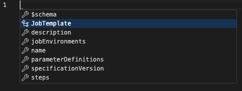
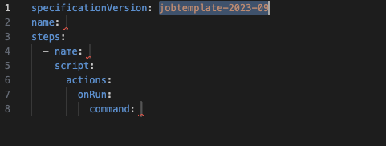
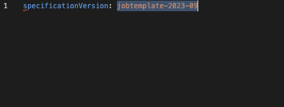

# Introduction to Creating a Job

This page guides you through developing a Job using Open Job Description to define the work you want
to run. A Job in Open Job Description is the work that is run on a distributed cluster of computers.
Jobs are a set of commands that are run on compute hosts subject to ordering, parallelism, and other
hardware and scheduling constraints (read more at [How Jobs Are Constructed](How-Jobs-Are-Constructed)
if you haven't already). Open Job Description defines Jobs via a Job Template. Creating a Job is an
exercise in creating a Job Template that describes the runtime environment, and the processes that will run.

This guide walks you through using the [Open Job Description CLI](https://pypi.org/project/openjd-cli/)
to develop and test jobs without needing to submit them to a compute cluster, and how to configure the
[Visual Studio Code](https://code.visualstudio.com/) editor to help you write Open Job Description templates.
You will also go through a gradual introduction to constructing Job Templates to define your Jobs that shows
you how to:

1. Embed scripts into your Job definition;
2. Parameterize a Job Template with Job Parameters;
3. Make use of path mapping rules available to your job;
4. Parallelize your workload by defining the parameter space for the Steps in your Job, including
   how to make use of range expressions, and how to chunk your workload to increase the amount of
   work done in each Task in your Job; and
5. How to define host requirements in the Steps of your Job to constrain which hosts are allowed to run
   the workload.

If you have not already read through [How Jobs Are Constructed](How-Jobs-Are-Constructed) and [How Jobs Are Run](How-Jobs-Are-Run)
then we recommend starting with those first. Those pages provide context that will help you
understand the remainder of this guide.

Table of Contents:

1. [Toolchain Setup](#1-toolchain-setup)
2. [Walkthrough](#2-walkthrough)
    1. [Starting with shell scripts](#21-starting-with-shell-scripts)
        1. [Creating a shell script to render with Blender](#211-creating-a-shell-script-to-render-with-blender)
        2. [Creating a shell script to encode a video with FFmpeg](#212-creating-a-shell-script-to-encode-a-video-with-ffmpeg)
    2. [Creating a Job Template](#22-creating-a-job-template)
        1. [Embed the scripts into a Job Template](#221-embed-the-scripts-into-a-job-template)
        2. [Parameterizing the template](#222-parameterizing-the-template)
        3. [Path Mapping](#223-path-mapping)
        4. [Adding Task Parallelism](#224-adding-task-parallelism)
    3. [Ready for Production](#23-ready-for-production)
        1. [Condition testing using environments](#231-conditional-testing-using-environments)
        2. [Adding host requirements](#232-adding-host-requirements)
        3. [The final result](#233-the-final-result)
3. [Next Steps](#3-next-steps)

## 1. Toolchain Setup

To replicate the steps taken in this guide you will need to have the [Open Job Description CLI](https://pypi.org/project/openjd-cli/),
[Python](https://www.python.org/), [Blender](https://www.blender.org/), and [FFmpeg](https://www.ffmpeg.org/) installed.
Open Job Description's CLI provides easy to use subcommands for validating the syntax of a Job Template,
running Tasks defined by a Job Template locally on your workstation, and more. The CLI is written in Python, so you will need to have
Python 3.9 or higher available on your workstation; for information on how to install Python, please see the official
[Python.org website](https://www.python.org/).

We suggest installing the tooling into a [Python virtual environment](https://docs.python.org/3/library/venv.html).

For writing Job Templates by hand we also recommend using [Visual Studio Code](https://code.visualstudio.com/)
and configuring it so that it can auto-complete the syntax of your Job Templates. To configure auto-complete, you
will first need to generate schema files for Open Job Description using the CLI:

```bash
mkdir ~/openjd-schemas
cd ~/openjd-schemas
openjd schema --version jobtemplate-2023-09 > openjobdescription-jobtemplate-2023-09.json
openjd schema --version environment-2023-09 > openjobdescription-environment-2023-09.json
```

Then install the official [Red Hat YAML](https://marketplace.visualstudio.com/items?itemName=redhat.vscode-yaml) extension, and 
modify your [Visual Studio Code settings](https://code.visualstudio.com/docs/languages/json#_json-schemas-and-settings)
to apply the Open Job Description schemas to your Job and Environment Templates. The following is an example of settings to
automatically apply the schemas to all JSON and YAML files on a workstation:

```json
    "json.schemas": [
        {"fileMatch": ["/**/*.json"], "url": "/Users/<username>/openjd-schemas/openjobdescription-jobtemplate-2023-09.json"},
        {"fileMatch": ["/**/*.json"], "url": "/Users/<username>/openjd-schemas/openjobdescription-environment-2023-09.json"}           
    ],
    "yaml.schemas": {
        "/Users/<username>/json-schemas/openjobdescription-jobtemplate-2023-09.json": [
            "/**/*.yaml"
        ],
        "/Users/myusername/json-schemas/openjobdescription-environment-2023-09.json": [
            "/**/*.yaml"
        ]
    }
```

To use auto-complete, simply use Control-Space and select a schema entity to automatically populate all of the entities required
fields, or select a field to auto-complete it:

| Menu | Selecting "JobTemplate" Entity | Selecting "specificationVersion" field |
| ---  | --- | ---- |
|  |  |  |

Note that if you prefer to programmatically generate Open Job Description templates, in a pipeline for instance,
then the [openjd-model](https://pypi.org/project/openjd-model/) Python package 
[supports that use case](https://github.com/OpenJobDescription/openjd-model-for-python?tab=readme-ov-file#converting-a-template-model-to-a-dictionary). 


## 2. Walkthrough

To demonstrate one way that you could develop a Job for Open Job Description this walkthrough will guide
you through creating a Job Template that generates frames of an animation using [Blender](https://www.blender.org/),
and then encodes those rendered frames into an mp4 video using [FFmpeg](https://ffmpeg.org/). We illustrate 
an approach to developing a Job that aims to keep your inner development loop fast by leveraging
the Open Job Description CLI to test the Job on your workstation. We also demonstrates making small incremental changes to make
it easier to narrow in on the root cause of an error. This process has faster iterations than submitting the Job
to your distributed compute cluster (AKA render farm), can be done in a cafe or airplane without an internet connection, and does
not even require that you have a compute cluster that supports Open Job Description.

### 2.1. Starting with shell scripts

An Open Job Description Job is, essentially, describing a set of command-line instructions to run, the inputs to those commands,
and the order in which they need to be run. We encourage you to think of authoring a Job as writing a series of shell
scripts that accomplish the objective of the Job when they are run in the correct order with the correct inputs.

In this guide, you are creating a Job that generates a sequence of frames of a Blender animation and then encodes the frames into
a movie file using FFmpeg. You'll break this Job down into two steps:

1. Generate the animation frames with Blender's command-line interface; and then
2. Encode the generated frames into an mp4 video file with FFmpeg.

Note that this walkthrough is written for a bash-compatible shell such as those available on typical Linux or
MacOS workstations. If you are using Windows, you will need to modify the commands for PowerShell or batch; though you may also
run bash scripts on Windows if you install an application such as [Git BASH](https://gitforwindows.org/).

#### 2.1.1. Creating a shell script to render with Blender

First, you'll create a shell script that calls the Blender command-line interface to render a part of the animation.
Looking up the [documentation for the Blender command line](https://docs.blender.org/manual/en/latest/advanced/command_line/arguments.html)
we created the following as a starting point for our Blender script:

```bash
#!/bin/bash

# Return an error code if any command in the script fails.
set -eou pipefail

# Use Blender's scripting interface to reduce the scene resolution and sampling rate to speed up testing.
# See https://www.gnu.org/savannah-checkouts/gnu/bash/manual/bash.html#Here-Documents
# Remove this and the lines below, `  --python "$TMPFILE" \` and `rm -f $TMPFILE`, after testing is complete.
TMPFILE=$(mktemp)
cat > "$TMPFILE" << EOF
import bpy
for s in bpy.data.scenes:
  s.render.resolution_x = 480
  s.render.resolution_y = 270
bpy.context.scene.cycles.samples = 100
EOF

# Run blender to generate the image frames.
blender --background 3d/pavillon_barcelone_v1.2.blend \
  --python "$TMPFILE" \
  --render-output output_frames/frame-### \
  --render-format PNG --use-extension 1 \
  --render-frame "1..2"

# Cleanup the temporary python script
rm -f $TMPFILE
```

This script makes some assumptions, such as being run from a directory that contains our input and output, that we'll modify next,
but this is a good start. It uses Blender to render two frames of the 380 frame animation created by
the ["Barcelona Pavillion" demo scene](https://www.blender.org/download/demo-files/#cycles) by eMirage, distributed under CC-BY
(accessed July 2024). Save this to a file called `render.sh`, set its execute bit (`chmod +x render.sh`), and then test it to verify
that it runs as expected:

```bash
% ./render.sh
Blender 4.1.1 (hash e1743a0317bc built 2024-04-16 00:06:22)
...
Fra:1 Mem:130.47M (Peak 206.18M) | Time:00:07.56 | Compositing | De-initializing execution
Saved: 'output_frames/frame-001.png'
...
Fra:2 Mem:130.48M (Peak 272.58M) | Time:00:07.64 | Compositing | De-initializing execution
Saved: 'output_frames/frame-002.png'
Time: 00:07.71 (Saving: 00:00.07)
```

Next, you'll want to be able to create a Job that can render any scene rather than just this one demo scene. So, parameterize the
script such that the scene file, output directory, and frames to render can all be passed in as command-line arguments to the script:

```bash
#!/bin/bash

# Return an error code if any command in the script fails.
set -eou pipefail

# Use Blender's scripting interface to reduce the scene resolution and sampling rate to speed up testing.
# See https://www.gnu.org/savannah-checkouts/gnu/bash/manual/bash.html#Here-Documents
# Remove this and the lines below, `  --python "$TMPFILE" \` and `rm -f $TMPFILE`, after testing is complete.
TMPFILE=$(mktemp)
cat > "$TMPFILE" << EOF
import bpy
for s in bpy.data.scenes:
  s.render.resolution_x = 480
  s.render.resolution_y = 270
bpy.context.scene.cycles.samples = 100
EOF

# Note: $1, $2, etc are the arguments passed to the shell script in order.
# See https://www.gnu.org/savannah-checkouts/gnu/bash/manual/bash.html#Positional-Parameters
SCENE="$1"
OUTDIR="$2"
START_FRAME="$3"
END_FRAME="$4"

blender --background "$SCENE" \
  --python "$TMPFILE" \
  --render-output "$OUTDIR"/frame-### \
  --render-format PNG --use-extension 1 \
  --render-frame "${START_FRAME}..${END_FRAME}"

rm -f $TMPFILE
```

Then test the script again:

```bash
% ./render.sh 3d/pavillon_barcelone_v1.2.blend output_frames 1 2
Blender 4.1.1 (hash e1743a0317bc built 2024-04-16 00:06:22)
...
Fra:2 Mem:130.48M (Peak 272.58M) | Time:00:08.09 | Compositing | De-initializing execution
Saved: 'output_frames/frame-002.png'
Time: 00:08.17 (Saving: 00:00.07)
```

#### 2.1.2. Creating a shell script to encode a video with FFmpeg

To create the script for FFmpeg encoding consult the [Academy Software Foundation's encoding guidelines](https://academysoftwarefoundation.github.io/EncodingGuidelines/)
on how to run FFmpeg:

```bash
#!/bin/bash

set -eou pipefail

ffmpeg -y -r 10 -start_number 1 -i output_frames/frame-%03d.png -pix_fmt yuv420p \
    -vf "scale=in_color_matrix=bt709:out_color_matrix=bt709" \
    -frames:v 300 -c:v libx264 -preset fast \
    -color_range tv -colorspace bt709 -color_primaries bt709 -color_trc iec61966-2-1 \
    -movflags faststart "animation.mp4"
```

Then, as with the Blender script, save it to a file (`encode.sh`), set its execute bits, and then test it:

```bash
% ./encode.sh 
ffmpeg version 6.1.1-tessus  https://evermeet.cx/ffmpeg/  Copyright (c) 2000-2023 the FFmpeg developers
...
```

Then modify it so that it accepts arguments from the command line:

```bash
#!/bin/bash

set -eou pipefail

INPUT_DIR="$1"
OUTPUT_FILENAME="$2"
START_FRAME="$3"

ffmpeg -y -r 10 -start_number "$START_FRAME" -i "$INPUT_DIR"/frame-%03d.png -pix_fmt yuv420p \
    -vf "scale=in_color_matrix=bt709:out_color_matrix=bt709" \
    -frames:v 300 -c:v libx264 -preset fast \
    -color_range tv -colorspace bt709 -color_primaries bt709 -color_trc iec61966-2-1 \
    -movflags faststart "$OUTPUT_FILENAME"
```

and then test it again:

```bash
% ./encode.sh output_frames animation.mp4 1                                           
ffmpeg version 6.1.1-tessus  https://evermeet.cx/ffmpeg/  Copyright (c) 2000-2023 the FFmpeg developers
...
```

## 2.2. Creating a Job Template

Once you have a set of shell scripts that accomplish the goals of your Job, the next step is to
create a Job Template from those shell scripts so that you can run the Job on your distributed
computing infrastructure. The Job Template describes the shape of the Job, its runtime environment,
and the processes that will run.

### 2.2.1. Embed the scripts into a Job Template

Starting with a skeleton of the minimal required properties of a Job Template:

```yaml
specificationVersion: jobtemplate-2023-09
name: 
steps:
  - name: 
    script:
      actions:
        onRun:
          command: 
```

Fill in the names for the Job that you're going to create, and the first Step that will run the Blender
rendering script:

```yaml
specificationVersion: jobtemplate-2023-09
name: DemoJob
steps:
  - name: BlenderRender
    script:
      actions:
        onRun:
          command: 
```

The way to think about a Step in Open Job Description is that it is defining a command to run and the collection of inputs
to run the command with. The command is defined in the `onRun` Action in the skeleton above. An Action in the 2023-09 
revision of the specification [is defined as](2023-09-Template-Schemas#5-action):

```yaml
command: <CommandString> # @fmtstring[host]
args: [ <ArgString>, ... ] # @optional @fmtstring[host]
timeout: <posinteger> # @optional
cancelation: <CancelationMethod> # @optional
```

Notice that both the `command` and elements of the `args` array are annotated with `@fmtstring[host]` indicating that
they are [Format Strings](How-Jobs-Are-Constructed#format-strings) that are evaluated on the host that the command will
run on. We're going to make use of this property to create our Job. For example, if the `onRun` action were defined as:

```yaml
command: /bin/echo
args: [ "Hello", "{{Task.Param.Person}}" ]
```

Then if the Step's inputs define the Task parameter "Person" to be the values `["Bob", "Sally"]` then the two commands
`/bin/echo "Hello Bob"` and `/bin/echo "Hello Sally"` will be run. We'll see how to define the inputs when we get to
[adding task parallelism](#224-adding-task-parallelism). If there are no inputs defined in a Step, then the command
is run once as given.

Aside: This is a [map operation](https://en.wikipedia.org/wiki/Map_(higher-order_function)).

You've created two shell scripts and can manually run them in sequence to approximate the results that we want. We can use
Open Job Description's concept of [Embedded Files](2023-09-Template-Schemas#6-embeddedfile) to put those scripts directly into
a Job template. An embedded file lets you define the contents of a text file directly in a Job Template, then that text file
will be created in the  [Session's temporary Working Directory](How-Jobs-Are-Run#sessions) when the Task is run.

The result is the start of your Job Template, which we save to file called `job.template.yaml`:

```yaml
specificationVersion: jobtemplate-2023-09
name: DemoJob
steps:
  - name: BlenderRender
    script:
      actions:
        onRun:
          # Note: Task.File.Render refers to the file location on disk where the
          #  contents of the embedded file named "Render" are materialized.
          command: "{{Task.File.Render}}"
          # Note that args is a list of strings. Each element of the list is a separate argument
          # to the command. For example, if we needed to pass "--frame 12" to a command, then
          # that would be two separate arguments ("--frame" and "12").
          args:
            - 3d/pavillon_barcelone_v1.2.blend
            - output_frames
            - "1"
            - "2"
      embeddedFiles:
        - name: Render
          type: TEXT
          filename: render.sh
          runnable: true
          data: |
            #!/bin/bash

            # Return an error code if any command in the script fails.
            set -eou pipefail

            # Use Blender's scripting interface to reduce the scene resolution and sampling rate to speed up testing.
            # See https://www.gnu.org/savannah-checkouts/gnu/bash/manual/bash.html#Here-Documents
            # Remove this and the lines below, `  --python "$TMPFILE" \` and `rm -f $TMPFILE`, after testing is complete.
            TMPFILE=$(mktemp)
            cat > "$TMPFILE" << EOF
            import bpy
            for s in bpy.data.scenes:
              s.render.resolution_x = 480
              s.render.resolution_y = 270
            bpy.context.scene.cycles.samples = 100
            EOF

            SCENE="$1"
            OUTDIR="$2"
            START_FRAME="$3"
            END_FRAME="$4"

            blender --background "$SCENE" \
              --python "$TMPFILE" \
              --render-output "$OUTDIR"/frame-### \
              --render-format PNG --use-extension 1 \
              --render-frame "${START_FRAME}..${END_FRAME}"

            rm -f $TMPFILE
```

Note that if you are writing your Job for Windows with the render script being a batch or PowerShell script, then you will
need to make a couple of changes from the above:

1. Change the `filename` in the embedded file to have the correct filename suffix (`.bat` for batch or `.ps1` for powershell); and
2. For powershell, change the `onRun` action to:

```yaml
command: powershell
args:
  - "-File"
  - "{{Task.File.Render}}"
  - 3d/pavillon_barcelone_v1.2.blend
  - output_frames
  - "1"
  - "2"
```

Before moving on, it's a good idea to check to the syntax of the file. Make sure to activate any Python virtual env as needed,
then use the CLI's `check` command:

```bash
% openjd check job.template.yaml
Template at 'job.template.yaml' passes validation checks.
```

Then, you can run it using the CLI's `run` command to make sure that it runs:

```bash
% openjd run --step BlenderRender job.template.yaml
Fri Jul  5 09:33:02 2024	
Fri Jul  5 09:33:02 2024	==============================================
Fri Jul  5 09:33:02 2024	--------- Running Task
Fri Jul  5 09:33:02 2024	==============================================
...
Fri Jul  5 09:33:02 2024	----------------------------------------------
Fri Jul  5 09:33:02 2024	Phase: Running action
Fri Jul  5 09:33:02 2024	----------------------------------------------
Fri Jul  5 09:33:02 2024	Running command /private/var/folders/93/p7mk/T/OpenJD/sample_session0bd5l1au/tmphe6bjl3c.sh
Fri Jul  5 09:33:02 2024	Command started as pid: 85706
Fri Jul  5 09:33:02 2024	Output:
Fri Jul  5 09:33:03 2024	Blender 4.1.1 (hash e1743a0317bc built 2024-04-16 00:06:22)
Fri Jul  5 09:33:03 2024	Error: Cannot read file "/private/var/folders/93/p7mk/T/OpenJD/sample_session0bd5l1au/3d/pavillon_barcelone_v1.2.blend": No such file or directory
Fri Jul  5 09:33:03 2024	
Fri Jul  5 09:33:03 2024	Blender quit
...
```

Uh-oh, there's an error! The error means that Blender couldn't find the input file. This is because all actions in a Session are always
run with their current working directory being the Session's temporary working directory, which was 
`/private/var/folders/93/p7mk/T/OpenJD/sample_session0bd5l1au` in this case. In our script, we've been using a relative path relative
path to the current working directory, and the scene file isn't in the Session's temporary
working directory; it's actually in `/Users/myusername/blender_demo/3d/pavillon_barcelone_v1.2.blend` on this workstation.
So, let's fix that up by changing the arguments to the command that the Task runs (note that we'll also have the same issue with
the `output_frames` directory, so we'll preemptively fix that as well):

```yaml
...
        onRun:
          # Note: Task.File.Render refers to the file location on disk where the
          #  contents of the embedded file named "Render" are materialized.
          command: "{{Task.File.Render}}"
          args:
            - /Users/myusername/blender_demo/3d/pavillon_barcelone_v1.2.blend
            - /Users/myusername/blender_demo/output_frames
            - "1"
            - "2"
...
```

Then check the template syntax and try to run it again:

```bash
% openjd check job.template.yaml            
Template at 'job.template.yaml' passes validation checks.
% openjd run --step BlenderRender job.template.yaml
Fri Jul  5 09:42:01 2024	
Fri Jul  5 09:42:01 2024	==============================================
Fri Jul  5 09:42:01 2024	--------- Running Task
Fri Jul  5 09:42:01 2024	==============================================
...
Fri Jul  5 09:42:18 2024	Open Job Description CLI: All actions completed successfully!
Fri Jul  5 09:42:18 2024	Open Job Description CLI: Local Session ended! Now cleaning up Session resources.

--- Results of local session ---

Session ended successfully

Job: DemoJob
Step: BlenderRender
Duration: 17.484004959 seconds
Tasks run: 1
```

Success! Also verify that the output are where we expect them to be:

```bash
% ls /Users/myusername/blender_demo/output_frames 
frame-001.png	frame-002.png
```

Before we continue adding functionality to your Job we're going to have you add a timeout to the Task. The timeout
property of an action limits how long that action is allowed to run. When the time limit is reached then the
command that's running will be canceled using the action's defined [cancelation method](2023-09-Template-Schemas#53-cancelationmethod)
(by default, all processes in the Task's process tree are stopped). The timeout is a guard-rail to help prevent misbehaving actions
from running forever; which can incur direct costs depending on your infrastructure (such as a cloud provider).

To test the timeout functionality works as expected, add a too short timeout,
test that it works using the CLI, and then modify the timeout value to something large enough to complete the Task:

```yaml
...
        onRun:
          command: "{{Task.File.Render}}"
          args:
            - /Users/myusername/blender_demo/3d/pavillon_barcelone_v1.2.blend
            - /Users/myusername/blender_demo/output_frames
            - "1"
            - "2"
          timeout: 2
...
```

Then run the change:

```bash
% openjd run --step BlenderRender job.template.yaml
Fri Jul  5 09:59:28 2024	
Fri Jul  5 09:59:28 2024	==============================================
Fri Jul  5 09:59:28 2024	--------- Running Task
Fri Jul  5 09:59:28 2024	==============================================
...
Fri Jul  5 09:59:30 2024	TIMEOUT - Runtime limit reached at 2024-07-05T14:59:30Z. Canceling action.
Fri Jul  5 09:59:30 2024	Canceling subprocess 88373 via termination method at 2024-07-05T14:59:30Z.
...
```

As expected, a timeout of 2 seconds is too short to allow the Blender render to complete, and the Job is cancelled. 

Make sure to modify the timeout to a larger value before going forward.

To complete this part of the guide, add a Step that encodes the video to your Job. This will follow the same
process that we've followed thus far, so we'll spare you the step-by-step instructions and jump straight to the completed template:

```yaml
specificationVersion: jobtemplate-2023-09
name: DemoJob
steps:
  - name: BlenderRender
    script:
      actions:
        onRun:
          command: "{{Task.File.Render}}"
          args:
            - /Users/myusername/blender_demo/3d/pavillon_barcelone_v1.2.blend
            - /Users/myusername/blender_demo/output_frames
            - "1"
            - "2"
          timeout: 60
      embeddedFiles:
        - name: Render
          type: TEXT
          filename: render.sh
          runnable: true
          data: |
            #!/bin/bash

            # Return an error code if any command in the script fails.
            set -eou pipefail

            # Use Blender's scripting interface to reduce the scene resolution and sampling rate to speed up testing.
            # See https://www.gnu.org/savannah-checkouts/gnu/bash/manual/bash.html#Here-Documents
            # Remove this and the lines below, `  --python "$TMPFILE" \` and `rm -f $TMPFILE`, after testing is complete.
            TMPFILE=$(mktemp)
            cat > "$TMPFILE" << EOF
            import bpy
            for s in bpy.data.scenes:
              s.render.resolution_x = 480
              s.render.resolution_y = 270
            bpy.context.scene.cycles.samples = 100
            EOF

            SCENE="$1"
            OUTDIR="$2"
            START_FRAME="$3"
            END_FRAME="$4"

            blender --background "$SCENE" \
              --python "$TMPFILE" \
              --render-output "$OUTDIR"/frame-### \
              --render-format PNG --use-extension 1 \
              --render-frame "${START_FRAME}..${END_FRAME}"

            rm -f $TMPFILE

  - name: EncodeVideo
    dependencies:
      - dependsOn: BlenderRender
    script:
      actions:
        onRun:
          command: "{{Task.File.Encode}}"
          args:
            - /Users/myusername/blender_demo/output_frames
            - /Users/myusername/blender_demo/animation.mp4
            - "1"
          timeout: 60
      embeddedFiles:
        - name: Encode
          type: TEXT
          runnable: true
          filename: encode.sh
          data: |
            #!/bin/bash

            set -eou pipefail

            INPUT_DIR="$1"
            OUTPUT_FILENAME="$2"
            START_FRAME="$3"

            ffmpeg -y -r 10 -start_number "$START_FRAME" -i "$INPUT_DIR"/frame-%03d.png -pix_fmt yuv420p \
                -vf "scale=in_color_matrix=bt709:out_color_matrix=bt709" \
                -frames:v 300 -c:v libx264 -preset fast \
                -color_range tv -colorspace bt709 -color_primaries bt709 -color_trc iec61966-2-1 \
                -movflags faststart "$OUTPUT_FILENAME"

```

Notice that the EncodeVideo Step differs from the BlenderRender Step in that it includes the definition of the Step's
[dependencies](2023-09-Template-Schemas#32-stepdependency). This ensures that when you submit the Job to a compute cluster
to run that the `BlenderRender` Step will run successfully to completion before the `EncodeVideo` Step is started. 

If your shell scripts in your actual Jobs are large then you may prefer to host them on a shared network fileshare
instead of embedding them directly within a Job Template. If you do so, then to avoid a potential command-injection attack on your
Jobs we remind you to ensure that no unauthorized users (including any running Job on the cluster) can possibly overwrite your scripts. 

### 2.2.2. Parameterizing the template

At this point you have a Job Template that has hard-coded values for the scene file and frame range. You can make this more
general by adding [Job Parameters](2023-09-Template-Schemas#2-jobparameterdefinition) to the template to allow changing things
like the scene file, frame range, and output locations when using the template to create a job.

In the spirit of small incremental improvements, let's start by turning the scene file into a parameter. This is a filename, so
it will be a [`PATH` type job parameter](2023-09-Template-Schemas#22-jobpathparameterdefinition). Modify the template to include
the parameter definition and [reference it using the name](https://github.com/OpenJobDescription/openjd-specifications/wiki/How-Jobs-Are-Constructed#value-references)
`Param.SceneFile` since it is a Job Parameter:

```yaml
specificationVersion: jobtemplate-2023-09
name: DemoJob
parameterDefinitions:
  - name: SceneFile
    type: PATH
    dataFlow: IN
    objectType: FILE
steps:
  - name: BlenderRender
    script:
      actions:
        onRun:
          command: "{{Task.File.Render}}"
          args:
            - "{{Param.SceneFile}}"
...
```

Then check the syntax and run it:

```bash
% openjd check job.template.yaml
Template at 'job.template.yaml' passes validation checks.

% openjd run --step BlenderRender job.template.yaml -p SceneFile=$(pwd)/3d/pavillon_barcelone_v1.2.blend
...
Session ended successfully

Job: DemoJob
Step: BlenderRender
Duration: 17.102627334 seconds
Tasks run: 1
```

Repeating the same for the other values that we want to parameterize:

1. The location of the `output_frames` directory and the output animation file's name are both [`PATH` type job parameters](2023-09-Template-Schemas#22-jobpathparameterdefinition);
2. The starting and ending frame number for the animation are both [`INT` type job parameters](2023-09-Template-Schemas#23-jobintparameterdefinition); and
3. The name of the job can be a [`STRING` type job parameter](2023-09-Template-Schemas#21-jobstringparameterdefinition).

The result will end up looking equivalent to:

```yaml
specificationVersion: jobtemplate-2023-09
name: "{{Param.JobName}}"
parameterDefinitions:
  - name: SceneFile
    type: PATH
    dataFlow: IN
    objectType: FILE
  - name: FramesDirectory
    type: PATH
    dataFlow: OUT
    objectType: DIRECTORY
  - name: AnimationFile
    type: PATH
    dataFlow: OUT
    objectType: FILE
  - name: FrameStart
    type: INT
    minValue: 1
    default: 1
  - name: FrameEnd
    type: INT
    minValue: 1
    default: 2
  - name: JobName
    type: STRING
    minLength: 1
    default: "DemoJob"
steps:
  - name: BlenderRender
    script:
      actions:
        onRun:
          command: "{{Task.File.Render}}"
          args:
            - "{{Param.SceneFile}}"
            - "{{Param.FramesDirectory}}"
            - "{{Param.FrameStart}}"
            - "{{Param.FrameEnd}}"
          timeout: 60
      embeddedFiles:
        - name: Render
          type: TEXT
          filename: render.sh
          runnable: true
          data: |
            #!/bin/bash

            # Return an error code if any command in the script fails.
            set -eou pipefail

            # Use Blender's scripting interface to reduce the scene resolution and sampling rate to speed up testing.
            # See https://www.gnu.org/savannah-checkouts/gnu/bash/manual/bash.html#Here-Documents
            # Remove this and the lines below, `  --python "$TMPFILE" \` and `rm -f $TMPFILE`, after testing is complete.
            TMPFILE=$(mktemp)
            cat > "$TMPFILE" << EOF
            import bpy
            for s in bpy.data.scenes:
              s.render.resolution_x = 480
              s.render.resolution_y = 270
            bpy.context.scene.cycles.samples = 100
            EOF

            SCENE="$1"
            OUTDIR="$2"
            START_FRAME="$3"
            END_FRAME="$4"

            blender --background "$SCENE" \
              --python "$TMPFILE" \
              --render-output "$OUTDIR"/frame-### \
              --render-format PNG --use-extension 1 \
              --render-frame "${START_FRAME}..${END_FRAME}"

            rm -f $TMPFILE

  - name: EncodeVideo
    dependencies:
      - dependsOn: BlenderRender
    script:
      actions:
        onRun:
          command: "{{Task.File.Encode}}"
          args:
            - "{{Param.FramesDirectory}}"
            - "{{Param.AnimationFile}}"
            - "{{Param.FrameStart}}"
          timeout: 60
      embeddedFiles:
        - name: Encode
          type: TEXT
          runnable: true
          filename: encode.sh
          data: |
            #!/bin/bash

            set -eou pipefail

            INPUT_DIR="$1"
            OUTPUT_FILENAME="$2"
            START_FRAME="$3"

            ffmpeg -y -r 10 -start_number "$START_FRAME" -i "$INPUT_DIR"/frame-%03d.png -pix_fmt yuv420p \
                -vf "scale=in_color_matrix=bt709:out_color_matrix=bt709" \
                -frames:v 300 -c:v libx264 -preset fast \
                -color_range tv -colorspace bt709 -color_primaries bt709 -color_trc iec61966-2-1 \
                -movflags faststart "$OUTPUT_FILENAME"
```

Finally, running it with the CLI:

```bash
% openjd run --step BlenderRender job.template.yaml \
  -p SceneFile=$(pwd)/3d/pavillon_barcelone_v1.2.blend \
  -p FramesDirectory=$(pwd)/output_frames \
  -p AnimationFile=$(pwd)/animation.mp4 \
  -p FrameStart=1 -p FrameEnd=2
Fri Jul  5 14:28:30 2024	
Fri Jul  5 14:28:30 2024	==============================================
Fri Jul  5 14:28:30 2024	--------- Running Task
Fri Jul  5 14:28:30 2024	==============================================
...
Session ended successfully

Job: DemoJob
Step: BlenderRender
Duration: 18.346753125 seconds
Tasks run: 1
```

Note that we are still running at low resolution for testing, so this run completes very quickly.

### 2.2.3. Path Mapping

You know the location of files on your workstation when submitting a Job to the orchestrater for your compute cluster,
but these locations may differ from where they'll be located on the hosts that will be running the Job.
For example, you may be developing your assets on a MacOS or Windows workstation but then running Jobs on Linux hosts in the cluster;
the operating systems might be the same but shared network filesystems may be mounted in different locations; or the assets reside
on the local hard drive on your workstation but will be automatically uploaded to an asset management system and materialized into
a different location on the compute host when the Job is running. For these kinds of cases, Open Job Description provides a
[path mapping](How-Jobs-Are-Run#path-mapping) mechanism to assist remapping the location of files directories from your workstation
to their location on the compute host where the Job will run.

The template that you've written so far is already set up to make use of the path mapping mechanism by using PATH type job parameters,
rather than STRING types for parameters that are files and directories. The PATH type parameters will automatically have any path mapping
rules applied to them when resolving the value in a template.

For the example, you ultimately want the job to use the files in the current directory when running. To demonstrate path mapping,
let's pretend that you're submitting from a different workstation where the files are located in the `/mnt/shared/demo` directory. 
You'll run the job with parameter values that say that the files are located in `/mnt/shared/demo` and create a path mapping rule that
tells Open Job Description to remap `/mnt/shared/demo` to the current working directory.

The format that Open Job Description expects for path mapping rules is described in [the specification](How-Jobs-Are-Run#path-mapping).
To make it easy to reference in your `openjd run` commmand, create an environment variable that defines the path mapping rule that you
need:

```bash
PATH_MAPPING_RULES=\
"{
  \"version\": \"pathmapping-1.0\",
  \"path_mapping_rules\": [
    {
      \"source_path_format\": \"POSIX\",
      \"source_path\": \"/mnt/shared/demo\",
      \"destination_path\": \"$(pwd)\"
    }
  ]
}"
```

Then, run the job using the CLI as though we were submitting from the workstation that has its files in `/mnt/shared/demo`:

```bash
% openjd run --step BlenderRender job.template.yaml \
  -p SceneFile=/mnt/shared/demo/3d/pavillon_barcelone_v1.2.blend \
  -p FramesDirectory=/mnt/shared/demo/output_frames \
  -p AnimationFile=/mnt/shared/demo/animation.mp4 \
  -p FrameStart=1 -p FrameEnd=2 \
  --path-mapping-rules "$PATH_MAPPING_RULES"
...
Fri Jul  5 17:09:47 2024	----------------------------------------------
Fri Jul  5 17:09:47 2024	Phase: Running action
Fri Jul  5 17:09:47 2024	----------------------------------------------
Fri Jul  5 17:09:47 2024	Running command /private/var/folders/93/p7mk/T/OpenJD/sample_sessionbr6836aq/tmp3x4fnush.sh
Fri Jul  5 17:09:47 2024	Command started as pid: 41372
Fri Jul  5 17:09:47 2024	Output:
Fri Jul  5 17:09:48 2024	Blender 4.1.1 (hash e1743a0317bc built 2024-04-16 00:06:22)
Fri Jul  5 17:09:48 2024	Read prefs: "/Users/myusername/Library/Application Support/Blender/4.1/config/userpref.blend"
Fri Jul  5 17:09:48 2024	Read blend: "/Users/myusername/blender_demo/3d/pavillon_barcelone_v1.2.blend"
...
```

This works because the `pavillon_barcelone_v1.2.blend` file references the files that it needs (the textures beside it in the directory)
with relative path references. If your job's files contain absolute file references, then your job will need to remap those references
in some way when running in a different filesystem configuration. Open Job Description makes the path mapping rules that are being applied
available in the Session's temporary working directory while your job is running. To see these, you can run the
[`path-mapping.yaml` sample Job Template](https://github.com/OpenJobDescription/openjd-specifications/tree/mainline/samples):

```bash
% PATH_MAPPING_RULES=\
"{
  \"version\": \"pathmapping-1.0\",
  \"path_mapping_rules\": [
    {
      \"source_path_format\": \"POSIX\",
      \"source_path\": \"/mnt/source_directory\",
      \"destination_path\": \"/mnt/destination_directory\"
    }
  ]
}"
% openjd run --step PrintRules path-mapping.yaml --path-mapping-rules "$PATH_MAPPING_RULES"
Mon Jul  8 15:02:42 2024	
Mon Jul  8 15:02:42 2024	==============================================
Mon Jul  8 15:02:42 2024	--------- Running Task
Mon Jul  8 15:02:42 2024	==============================================
...
Mon Jul  8 15:02:42 2024	Output:
Mon Jul  8 15:02:43 2024	{"version": "pathmapping-1.0", "path_mapping_rules": [{"source_path_format": "POSIX", "source_path": "/mnt/source_directory", "destination_path": "/mnt/destination_directory"}]}
...
```

You may have to write custom scripting in your Job to translate these path mapping rules into the format that your application expects;
such as to the format for the  
[`--remap` option for Foundry's Nuke](https://learn.foundry.com/nuke/content/comp_environment/configuring_nuke/command_line_operations.html).

At this point, if you have access to a compute cluster orchestrater that supports Open Job Description then you can test your Job
on your cluster to ensure that it works before adding in additional complexity to it. The Job is in a relatively simple state right
now and that will make any debugging that you need to do to bring the Job to a different host easier to manage.

### 2.2.4. Adding Task Parallelism

Running the Job that you have so far at production quality will take about 2.6 days of CPU time at the average of 10 minutes for
each image frame that we're seeing on an Apple M1 workstation. We can decrease the amount of time that we have to wait for the results
by spreading out the work over multiple hosts in a distributed compute cluster (and by using a GPU renderer). Next in this guide, you'll
partition the work for the `BlenderRender` Step into multiple Tasks, each of which can be run independently.

You define the Tasks for a Step using the [`parameterSpace` property](2023-09-Template-Schemas#34-stepparameterspacedefinition) in
the Step's definition. You use this property to define the collection of inputs that the Step's `onRun` action is run with.
In this case, you can create Tasks that either each render a single frame or each render a contiguous group of frames.
Let's go over both.

#### 2.2.4.1. One Frame per Task

The `render.sh` embedded script that you're using in the Job currently renders a sequence of frames rather than a single frame, so
to render a single frame in each Task you'll first need to modify and test the `render.sh` embedded script.
We suggest making the modifications outside of the template, testing them, and then copying the modifications into the template when
complete. This will help you make rapid changes without having to go through the Open Job Description CLI and let you benefit from
the features of your IDE, such as syntax highlighting and validation, that help you author shell scripts. The modified script to render
a single frame at a time looks like:

```bash
#!/bin/bash

# Return an error code if any command in the script fails.
set -eou pipefail

# Use Blender's scripting interface to reduce the scene resolution and sampling rate to speed up testing.
# See https://www.gnu.org/savannah-checkouts/gnu/bash/manual/bash.html#Here-Documents
# Remove this and the lines below, `  --python "$TMPFILE" \` and `rm -f $TMPFILE`, after testing is complete.
TMPFILE=$(mktemp)
cat > "$TMPFILE" << EOF
import bpy
for s in bpy.data.scenes:
  s.render.resolution_x = 480
  s.render.resolution_y = 270
bpy.context.scene.cycles.samples = 100
EOF

SCENE="$1"
OUTDIR="$2"
FRAME="$3"

blender --background "$SCENE" \
  --python "$TMPFILE" \
  --render-output "$OUTDIR"/frame-### \
  --render-format PNG --use-extension 1 \
  --render-frame "${FRAME}"

rm -f $TMPFILE
```

After copying that into the Job Template, create the Step's parameter space to define a single [`INT` type Task parameter](2023-09-Template-Schemas#3411-inttaskparameterdefinition) called `Frame` with a range of values from the `StartFrame` to the `EndFrame`:

```yaml
...
  - name: BlenderRender
    parameterSpace:
      taskParameterDefinitions:
        - name: Frame
          type: INT
          range: "{{Param.FrameStart}}-{{Param.FrameEnd}}"
...
```

If you run this template with, say, `FrameStart=1` and `FrameEnd=380`, then this says that the Step has 380 separate Tasks; one with
each of the integer values for `Frame` from 1 to 380.

Next, modify the command arguments for the Step to pass the value of `Frame` to the `render.sh` script to match our modification to it:

```yaml
...
      actions:
        onRun:
          command: "{{Task.File.Render}}"
          args:
            - "{{Param.SceneFile}}"
            - "{{Param.FramesDirectory}}"
            - "{{Task.Param.Frame}}"
          timeout: 60
...
```

That's it. You're ready to check the syntax of the template, and use the CLI to test the change locally by running a single Task
from the Step:

```bash
% openjd check job.template.yaml 
Template at 'job.template.yaml' passes validation checks.

% openjd run --step BlenderRender job.template.yaml \
  -tp Frame=100 \
  -p SceneFile=$(pwd)/3d/pavillon_barcelone_v1.2.blend \
  -p FramesDirectory=$(pwd)/output_frames \
  -p AnimationFile=$(pwd)/animation.mp4 \
  -p FrameStart=1 -p FrameEnd=380
Mon Jul  8 10:08:24 2024	
Mon Jul  8 10:08:24 2024	==============================================
Mon Jul  8 10:08:24 2024	--------- Running Task
Mon Jul  8 10:08:24 2024	==============================================
Mon Jul  8 10:08:24 2024	Parameter values:
Mon Jul  8 10:08:24 2024	Frame(INT) = 100
...
```

If you were to run the CLI without the `-tp` argument, then it would have rendered all 380 frames of the animation. 
To demonstrate, run the CLI without `-tp` but set the value of `FrameEnd` to 3 instead of 380:

```bash
% openjd run --step BlenderRender job.template.yaml \
  -p SceneFile=$(pwd)/3d/pavillon_barcelone_v1.2.blend \
  -p FramesDirectory=$(pwd)/output_frames \
  -p AnimationFile=$(pwd)/animation.mp4 \
  -p FrameStart=1 -p FrameEnd=3
Mon Jul  8 10:13:05 2024	
Mon Jul  8 10:13:05 2024	==============================================
Mon Jul  8 10:13:05 2024	--------- Running Task
Mon Jul  8 10:13:05 2024	==============================================
Mon Jul  8 10:13:05 2024	Parameter values:
Mon Jul  8 10:13:05 2024	Frame(INT) = 1
...
Mon Jul  8 10:13:14 2024	==============================================
Mon Jul  8 10:13:14 2024	--------- Running Task
Mon Jul  8 10:13:14 2024	==============================================
Mon Jul  8 10:13:14 2024	Parameter values:
Mon Jul  8 10:13:14 2024	Frame(INT) = 2
...
Mon Jul  8 10:13:25 2024	==============================================
Mon Jul  8 10:13:25 2024	--------- Running Task
Mon Jul  8 10:13:25 2024	==============================================
Mon Jul  8 10:13:25 2024	Parameter values:
Mon Jul  8 10:13:25 2024	Frame(INT) = 3
```

The complete template at this point looks like:

```yaml
specificationVersion: jobtemplate-2023-09
name: "{{Param.JobName}}"
parameterDefinitions:
  - name: SceneFile
    type: PATH
    dataFlow: IN
    objectType: FILE
  - name: FramesDirectory
    type: PATH
    dataFlow: OUT
    objectType: DIRECTORY
  - name: AnimationFile
    type: PATH
    dataFlow: OUT
    objectType: FILE
  - name: FrameStart
    type: INT
    minValue: 1
    default: 1
  - name: FrameEnd
    type: INT
    minValue: 1
    default: 2
  - name: JobName
    type: STRING
    minLength: 1
    default: "DemoJob"
steps:
  - name: BlenderRender
    parameterSpace:
      taskParameterDefinitions:
        - name: Frame
          type: INT
          range: "{{Param.FrameStart}}-{{Param.FrameEnd}}"
    script:
      actions:
        onRun:
          command: "{{Task.File.Render}}"
          args:
            - "{{Param.SceneFile}}"
            - "{{Param.FramesDirectory}}"
            - "{{Task.Param.Frame}}"
          timeout: 60
      embeddedFiles:
        - name: Render
          type: TEXT
          filename: render.sh
          runnable: true
          data: |
            #!/bin/bash

            # Return an error code if any command in the script fails.
            set -eou pipefail

            # Use Blender's scripting interface to reduce the scene resolution and sampling rate to speed up testing.
            # See https://www.gnu.org/savannah-checkouts/gnu/bash/manual/bash.html#Here-Documents
            # Remove this and the lines below, `  --python "$TMPFILE" \` and `rm -f $TMPFILE`, after testing is complete.
            TMPFILE=$(mktemp)
            cat > "$TMPFILE" << EOF
            import bpy
            for s in bpy.data.scenes:
              s.render.resolution_x = 480
              s.render.resolution_y = 270
            bpy.context.scene.cycles.samples = 100
            EOF

            SCENE="$1"
            OUTDIR="$2"
            FRAME="$3"

            blender --background "$SCENE" \
              --python "$TMPFILE" \
              --render-output "$OUTDIR"/frame-### \
              --render-format PNG --use-extension 1 \
              --render-frame "${FRAME}"

            rm -f $TMPFILE

  - name: EncodeVideo
    dependencies:
      - dependsOn: BlenderRender
    script:
      actions:
        onRun:
          command: "{{Task.File.Encode}}"
          args:
            - "{{Param.FramesDirectory}}"
            - "{{Param.AnimationFile}}"
            - "{{Param.FrameStart}}"
          timeout: 60
      embeddedFiles:
        - name: Encode
          type: TEXT
          runnable: true
          filename: encode.sh
          data: |
            #!/bin/bash

            set -eou pipefail

            INPUT_DIR="$1"
            OUTPUT_FILENAME="$2"
            START_FRAME="$3"

            ffmpeg -y -r 10 -start_number "$START_FRAME" -i "$INPUT_DIR"/frame-%03d.png -pix_fmt yuv420p \
                -vf "scale=in_color_matrix=bt709:out_color_matrix=bt709" \
                -frames:v 300 -c:v libx264 -preset fast \
                -color_range tv -colorspace bt709 -color_primaries bt709 -color_trc iec61966-2-1 \
                -movflags faststart "$OUTPUT_FILENAME"

```

#### 2.2.4.2. Multiple Frames Per Task

Some rendering applications may take a significant amount of time to startup and load the data that it needs to work. In this case,
you may wish to render multiple contiguous frames of the animation in each Task. There are two ways that you can accomplish this
with Open Job Description:

1. Define Task parameters for the start and end of the range of frames to render in each Task and leverage a
   [combination expression](2023-09-Template-Schemas#343-combinationexpr) to combine them; or
2. Define Task parameter as a `STRING` type and hardcode the range of frames that we want to render in each Task.

We'll go through both options.

##### 2.2.4.2.1. With a Combination Expression

The combination expression in a Step's parameter space gives you a way to choose how the Task parameters are combined to create
the collection of Task values for the Step. For example, if you have a parameter space like:

```yaml
parameterSpace:
  taskParameterDefinitions:
  - name: Num
    type: INT
    range: "1-3"
  - name: Letter
    type: STRING
    range:
    - 'A'
    - 'B'
    - 'C'
```

Then the default combination expression `Num * Letter` produces a parameter space with the nine values 
`{Num=1, Letter=A}, {Num=1, Letter=B}, ... {Num=3, Letter=B}, {Num=3, Letter=C}`. However, a combination expression using the
association operator, `(Num,Letter)`, produces a parameter space with only three values:
`{Num=1,Letter=A}, {Num=2,Letter=B}, {Num=3,Letter=C}`.

Using the association operator, define the Step's parameter space as:

```yaml
...
    parameterSpace:
      taskParameterDefinitions:
        # RangeStart = 1,12,23,34,...,374
        - name: RangeStart
          type: INT
          range: "1-380:11"
        # RangeEnd = 11,22,33,44,...373,380
        - name: RangeEnd
          type: INT
          range: "11-380:11,380"
      # Tasks = (1,11), (12,22), (23,33), ... etc
      combination: "(RangeStart,RangeEnd)"
...
```

Aside: The value for the `range` property are using
[Open Job Description's syntax](https://github.com/OpenJobDescription/openjd-specifications/wiki/2023-09-Template-Schemas#34111-intrangeexpr)
for integer range expressions. The value "1-380:11" means to take every 11th value starting at 1 and going no higher than 380; so, the values
`1, 12, 23, ..., 374`. The value value "11-380:11,380" is similar, but adds the value 380 to the end of the list of value to end up with
`11, 22, 33, ..., 373, 380`. The end result of these definitions and the combination expression is that each task will run on a frame
range that looks like `1-11`, `12-22`, etc.

Then introduce a new Job Parameter for the number of frames per Task and one less than `FrameEnd`, to work around a current limitation of
the implementation. Also, convert the parameter space definition to use the template's Job Parameters, and modify the arguments of
the `BlenderRender` Step's command to pass the frame range expression for the Task to the `render.sh` script:

```yaml
parameterDefinitions:
...
  - name: FrameEndMinusOne
    description: "Must be one less than the FrameEnd value"
    type: INT
  - name: FramesPerTask
    description: "Number of frames to render in each task. Note: The math breaks if FrameEnd is an integer multiple of FramesPerTask."
    type: INT
    default: 11
...
steps:
  - name: BlenderRender
    parameterSpace:
      taskParameterDefinitions:
        - name: RangeStart
          type: INT
          range: "{{Param.FrameStart}}-{{Param.FrameEnd}}:{{Param.FramesPerTask}}"
        - name: RangeEnd
          type: INT
          range: "{{Param.FramesPerTask}}-{{Param.FrameEndMinusOne}}:{{Param.FramesPerTask}},{{Param.FrameEnd}}"
      combination: "(RangeStart,RangeEnd)"
    script:
      actions:
        onRun:
          command: "{{Task.File.Render}}"
          args:
            - "{{Param.SceneFile}}"
            - "{{Param.FramesDirectory}}"
            - "{{Task.Param.RangeStart}}..{{Task.Param.RangeEnd}}"
...
```

Then check the syntax for the template, and test it locally using the CLI:

```bash
% openjd check job.template.yaml                     
Template at 'job.template.yaml' passes validation checks.

% openjd run --step BlenderRender job.template.yaml \
  -p SceneFile=$(pwd)/3d/pavillon_barcelone_v1.2.blend \
  -p FramesDirectory=$(pwd)/output_frames \
  -p AnimationFile=$(pwd)/animation.mp4 \
  -p FrameStart=1 -p FrameEnd=380 -p FrameEndMinusOne=379 \
  -p FramesPerTask=11 \
  --tasks '[{"RangeStart": 1, "RangeEnd": 11}]'
Mon Jul  8 12:23:56 2024	
Mon Jul  8 12:23:56 2024	==============================================
Mon Jul  8 12:23:56 2024	--------- Running Task
Mon Jul  8 12:23:56 2024	==============================================
Mon Jul  8 12:23:56 2024	Parameter values:
Mon Jul  8 12:23:56 2024	RangeStart(INT) = 1
Mon Jul  8 12:23:56 2024	RangeEnd(INT) = 11
...
```

The Job Template is now:

```yaml
specificationVersion: jobtemplate-2023-09
name: "{{Param.JobName}}"
parameterDefinitions:
  - name: SceneFile
    type: PATH
    dataFlow: IN
    objectType: FILE
  - name: FramesDirectory
    type: PATH
    dataFlow: OUT
    objectType: DIRECTORY
  - name: AnimationFile
    type: PATH
    dataFlow: OUT
    objectType: FILE
  - name: FrameStart
    type: INT
    minValue: 1
    default: 1
  - name: FrameEnd
    type: INT
    minValue: 1
    default: 2
  - name: FrameEndMinusOne
    description: "Must be one less than the FrameEnd value"
    type: INT
  - name: FramesPerTask
    description: "Number of frames to render in each task. Note: The math breaks if FrameEnd is an integer multiple of FramesPerTask."
    type: INT
    default: 11
  - name: JobName
    type: STRING
    minLength: 1
    default: "DemoJob"
steps:
  - name: BlenderRender
    parameterSpace:
      taskParameterDefinitions:
        - name: RangeStart
          type: INT
          range: "{{Param.FrameStart}}-{{Param.FrameEnd}}:{{Param.FramesPerTask}}"
        - name: RangeEnd
          type: INT
          range: "{{Param.FramesPerTask}}-{{Param.FrameEndMinusOne}}:{{Param.FramesPerTask}},{{Param.FrameEnd}}"
      combination: "(RangeStart,RangeEnd)"
    script:
      actions:
        onRun:
          command: "{{Task.File.Render}}"
          args:
            - "{{Param.SceneFile}}"
            - "{{Param.FramesDirectory}}"
            - "{{Task.Param.RangeStart}}..{{Task.Param.RangeEnd}}"
          timeout: 2400
      embeddedFiles:
        - name: Render
          type: TEXT
          filename: render.sh
          runnable: true
          data: |
            #!/bin/bash

            # Return an error code if any command in the script fails.
            set -eou pipefail

            # Use Blender's scripting interface to reduce the scene resolution and sampling rate to speed up testing.
            # See https://www.gnu.org/savannah-checkouts/gnu/bash/manual/bash.html#Here-Documents
            # Remove this and the lines below, `  --python "$TMPFILE" \` and `rm -f $TMPFILE`, after testing is complete.
            TMPFILE=$(mktemp)
            cat > "$TMPFILE" << EOF
            import bpy
            for s in bpy.data.scenes:
              s.render.resolution_x = 480
              s.render.resolution_y = 270
            bpy.context.scene.cycles.samples = 100
            EOF

            SCENE="$1"
            OUTDIR="$2"
            FRAME="$3"

            blender --background "$SCENE" \
              --python "$TMPFILE" \
              --render-output "$OUTDIR"/frame-### \
              --render-format PNG --use-extension 1 \
              --render-frame "${FRAME}"

            rm -f $TMPFILE

  - name: EncodeVideo
    dependencies:
      - dependsOn: BlenderRender
    script:
      actions:
        onRun:
          command: "{{Task.File.Encode}}"
          args:
            - "{{Param.FramesDirectory}}"
            - "{{Param.AnimationFile}}"
            - "{{Param.FrameStart}}"
          timeout: 60
      embeddedFiles:
        - name: Encode
          type: TEXT
          runnable: true
          filename: encode.sh
          data: |
            #!/bin/bash

            set -eou pipefail

            INPUT_DIR="$1"
            OUTPUT_FILENAME="$2"
            START_FRAME="$3"

            ffmpeg -y -r 10 -start_number "$START_FRAME" -i "$INPUT_DIR"/frame-%03d.png -pix_fmt yuv420p \
                -vf "scale=in_color_matrix=bt709:out_color_matrix=bt709" \
                -frames:v 300 -c:v libx264 -preset fast \
                -color_range tv -colorspace bt709 -color_primaries bt709 -color_trc iec61966-2-1 \
                -movflags faststart "$OUTPUT_FILENAME"
```

##### 2.2.4.2.2 As STRING Type

This option is only suitable for cases where you will be writing or programmatically generating a Job Template for a specific input
because the `FrameStart` and `FrameEnd` values need to be known when defining the set of values for the Task parameter. To create the 
parameter space, decide how many frames you want in each Task (we picked 40 in this case to cut down on typing) and then write out
the frame expressions that Blender requires as the values of the Task parameter

```yaml
parameterSpace:
      taskParameterDefinitions:
        - name: Frames
          type: STRING
          range:
          - "1..40"
          - "41..80"
          - "81..120"
... and so on until
          - "361-380"
...
```

Also remove the definitions of the `FrameStart` and `FrameEnd` Job Parameters from the template because they are no longer used;
adjust the arguments of the `EncodeVideo` command to remove the reference to the `FrameStart` job parameter; and increase
the timeout for the render command to be large enough to complete all of the frame renders for the task.
The resulting template is otherwise identical to the template that you created in [One Frame Per Task](#one-frame-per-task):

```yaml
specificationVersion: jobtemplate-2023-09
name: "{{Param.JobName}}"
parameterDefinitions:
  - name: SceneFile
    type: PATH
    dataFlow: IN
    objectType: FILE
  - name: FramesDirectory
    type: PATH
    dataFlow: OUT
    objectType: DIRECTORY
  - name: AnimationFile
    type: PATH
    dataFlow: OUT
    objectType: FILE
  - name: JobName
    type: STRING
    minLength: 1
    default: "DemoJob"
steps:
  - name: BlenderRender
    parameterSpace:
      taskParameterDefinitions:
        - name: Frames
          type: STRING
          range:
          - "1..40"
          - "41..80"
          - "81..120"
          - "121..160"
          - "161-200"
          - "201-240"
          - "241-280"
          - "281-320"
          - "321-360"
          - "361-380"
    script:
      actions:
        onRun:
          command: "{{Task.File.Render}}"
          args:
            - "{{Param.SceneFile}}"
            - "{{Param.FramesDirectory}}"
            - "{{Task.Param.Frames}}"
          timeout: 2400 # 40 frames at 60s per frame
      embeddedFiles:
        - name: Render
          type: TEXT
          filename: render.sh
          runnable: true
          data: |
            #!/bin/bash

            # Return an error code if any command in the script fails.
            set -eou pipefail

            # Use Blender's scripting interface to reduce the scene resolution and sampling rate to speed up testing.
            # See https://www.gnu.org/savannah-checkouts/gnu/bash/manual/bash.html#Here-Documents
            # Remove this and the lines below, `  --python "$TMPFILE" \` and `rm -f $TMPFILE`, after testing is complete.
            TMPFILE=$(mktemp)
            cat > "$TMPFILE" << EOF
            import bpy
            for s in bpy.data.scenes:
              s.render.resolution_x = 480
              s.render.resolution_y = 270
            bpy.context.scene.cycles.samples = 100
            EOF

            SCENE="$1"
            OUTDIR="$2"
            FRAME="$3"

            blender --background "$SCENE" \
              --python "$TMPFILE" \
              --render-output "$OUTDIR"/frame-### \
              --render-format PNG --use-extension 1 \
              --render-frame "${FRAME}"

            rm -f $TMPFILE

  - name: EncodeVideo
    dependencies:
      - dependsOn: BlenderRender
    script:
      actions:
        onRun:
          command: "{{Task.File.Encode}}"
          args:
            - "{{Param.FramesDirectory}}"
            - "{{Param.AnimationFile}}"
            - "1"
          timeout: 60
      embeddedFiles:
        - name: Encode
          type: TEXT
          runnable: true
          filename: encode.sh
          data: |
            #!/bin/bash

            set -eou pipefail

            INPUT_DIR="$1"
            OUTPUT_FILENAME="$2"
            START_FRAME="$3"

            ffmpeg -y -r 10 -start_number "$START_FRAME" -i "$INPUT_DIR"/frame-%03d.png -pix_fmt yuv420p \
                -vf "scale=in_color_matrix=bt709:out_color_matrix=bt709" \
                -frames:v 300 -c:v libx264 -preset fast \
                -color_range tv -colorspace bt709 -color_primaries bt709 -color_trc iec61966-2-1 \
                -movflags faststart "$OUTPUT_FILENAME"
```

As usual, you can check the syntax of the template and then try it out locally using the CLI:

```bash
% openjd check job.template.yaml                     
Template at 'job.template.yaml' passes validation checks.

% openjd run --step BlenderRender job.template.yaml \
  -tp Frames=1..40 \
  -p SceneFile=$(pwd)/3d/pavillon_barcelone_v1.2.blend \
  -p FramesDirectory=$(pwd)/output_frames \
  -p AnimationFile=$(pwd)/animation.mp4
Mon Jul  8 10:48:30 2024	
Mon Jul  8 10:48:30 2024	==============================================
Mon Jul  8 10:48:30 2024	--------- Running Task
Mon Jul  8 10:48:30 2024	==============================================
Mon Jul  8 10:48:30 2024	Parameter values:
Mon Jul  8 10:48:30 2024	Frames(STRING) = 1..40
...
```

### 2.3. Ready for Production

To develop the Job Template for this guide you've been reducing the resolution and quality of the resulting frames to make the
development iterations quicker. To use the template in production you'll need to remove that testing code. You may also want to
control which compute nodes in your cluster the Steps of the Job run on. We'll go over both in this section.

#### 2.3.1. Conditional Testing Using Environments

To use the template in production you'd either need to remove the testing code from the `render.sh`
embedded file so that it becomes:

```bash
#!/bin/bash

# Return an error code if any command in the script fails.
set -eou pipefail

SCENE="$1"
OUTDIR="$2"
FRAME="$3"

blender --background "$SCENE" \
  --render-output "$OUTDIR"/frame-### \
  --render-format PNG --use-extension 1 \
  --render-frame "${FRAME}"
```

or you need to modify the template so that it has both a testing and production mode. We'll do the later in this guide to demonstrate
using [Environments](2023-09-Template-Schemas#4-environment) in a Job Template. Think of Environments as encapsulating commands that you
can run [before any Task has run, and after all Tasks have completed](How-Jobs-Are-Run#sessions) (whether successfully or not).
Since they're just arbitrary commands of your choosing they can do anything that you would like, but one of their use cases is to
set up or modify the environment where your Tasks will be running.

For this case, modify the `render.sh` embedded file so that the testing code is only run if the environment variable
`TESTING_TEMPLATE` has the value `true`:

```bash
#!/bin/bash

# Return an error code if any command in the script fails.
set -eou pipefail

# Use Blender's scripting interface to reduce the scene resolution and sampling rate to speed up testing.
# See https://www.gnu.org/savannah-checkouts/gnu/bash/manual/bash.html#Here-Documents
TMPFILE=$(mktemp)
if test "${TESTING_TEMPLATE:-false}" == "true"; then
    cat > "$TMPFILE" << EOF
import bpy
for s in bpy.data.scenes:
s.render.resolution_x = 480
s.render.resolution_y = 270
bpy.context.scene.cycles.samples = 100
EOF
fi

SCENE="$1"
OUTDIR="$2"
FRAME="$3"

blender --background "$SCENE" \
  --python "$TMPFILE" \
  --render-output "$OUTDIR"/frame-### \
  --render-format PNG --use-extension 1 \
  --render-frame "${FRAME}"

rm -f $TMPFILE
```

Then you can add a Step Environment to the `BlenderRender` Step that sets that environment variable to `true` or `false`
based on the value of a `TestingMode` Job Parameter:

```yaml
...
parameterDefinitions:
...
  - name: TestingMode
    type: STRING
    allowedValues: ["true", "false"]
    default: "false"
...
  - name: BlenderRender
    stepEnvironments:
      - name: ToggleTesting
        variables:
          TESTING_TEMPLATE: "{{Param.TestingMode}}"
      # - name: ToggleTesting
      #   description: "An alternative form that uses the openjd_env stdout message"
      #   script:
      #     actions:
      #       onEnter:
      #         command: "{{Env.File.SetEnv}}"
      #     embeddedFiles:
      #       - name: SetEnv
      #         type: TEXT
      #         runnable: true
      #         filename: set_testing_env.sh
      #         data: |
      #           #!/bin/bash
      #           echo "openjd_env: TESTING_TEMPLATE={{Param.TestingMode}}"
...
```

When you run this template, notice that the log now shows that the Session is entering the `ToggleTesting` environment
before running the Task:

```bash
Mon Jul  8 14:23:44 2024	
Mon Jul  8 14:23:44 2024	==============================================
Mon Jul  8 14:23:44 2024	--------- Entering Environment: ToggleTesting
Mon Jul  8 14:23:44 2024	==============================================
Mon Jul  8 14:23:44 2024	Setting: TESTING_TEMPLATE=true
Mon Jul  8 14:23:44 2024	
Mon Jul  8 14:23:44 2024	==============================================
Mon Jul  8 14:23:44 2024	--------- Running Task
Mon Jul  8 14:23:44 2024	==============================================
Mon Jul  8 14:23:44 2024	Parameter values:
Mon Jul  8 14:23:44 2024	RangeStart(INT) = 1
Mon Jul  8 14:23:44 2024	RangeEnd(INT) = 11
...
```

#### 2.3.2. Adding Host Requirements

The definition of each Step in a Job Template can include a
[`hostRequirements` property](https://github.com/OpenJobDescription/openjd-specifications/wiki/2023-09-Template-Schemas#33-hostrequirements)
that, if supported by your compute orchestrator, will constrain the Step's Tasks to only run on certain hardware. For instance, you can say that
the Tasks must run on a Linux host, requires at least 16 GiB of memory, and requires at least 8 CPU cores.

Add host requirements to the `BlenderRender` Step to constrain which hosts in your compute cluster can run its Tasks:

```yaml
...
steps:
  - name: BlenderRender
...
    hostRequirements:
      amounts:
      - name: amount.worker.vcpu
        min: 4
      - name: amount.worker.memory
        min: 4096 # MiB. = 4 GiB
      attributes:
      - name: attr.worker.os.family
        anyOf: [ "linux" ]
      - name: attr.worker.cpu.arch
        anyOf: [ "x86_64" ]
    script:
...
```
 
 The Open Job Description CLI does not currently support enforcing the constraints defined by host requirements, so you can
 validate the template syntax using the CLI but you will have to test the constraints on your compute cluster.

#### 2.3.3. The Final Result

The completed template now looks like:

```yaml
specificationVersion: jobtemplate-2023-09
name: "{{Param.JobName}}"
parameterDefinitions:
  - name: SceneFile
    type: PATH
    dataFlow: IN
    objectType: FILE
  - name: FramesDirectory
    type: PATH
    dataFlow: OUT
    objectType: DIRECTORY
  - name: AnimationFile
    type: PATH
    dataFlow: OUT
    objectType: FILE
  - name: FrameStart
    type: INT
    minValue: 1
    default: 1
  - name: FrameEnd
    type: INT
    minValue: 1
    default: 2
  - name: FrameEndMinusOne
    description: "Must be one less than the FrameEnd value"
    type: INT
  - name: FramesPerTask
    description: "Number of frames to render in each task. Note: The math breaks if FrameEnd is an integer multiple of FramesPerTask."
    type: INT
    default: 11
  - name: JobName
    type: STRING
    minLength: 1
    default: "DemoJob"
  - name: TestingMode
    type: STRING
    allowedValues: ["true", "false"]
    default: "false"
steps:
  - name: BlenderRender
    stepEnvironments:
      - name: ToggleTesting
        variables:
          TESTING_TEMPLATE: "{{Param.TestingMode}}"
      # - name: ToggleTesting
      #   description: "An alternative form that uses the openjd_env stdout message"
      #   script:
      #     actions:
      #       onEnter:
      #         command: "{{Env.File.SetEnv}}"
      #     embeddedFiles:
      #       - name: SetEnv
      #         type: TEXT
      #         runnable: true
      #         filename: set_testing_env.sh
      #         data: |
      #           #!/bin/bash
      #           echo "openjd_env: TESTING_TEMPLATE={{Param.TestingMode}}"
    parameterSpace:
      taskParameterDefinitions:
        - name: RangeStart
          type: INT
          range: "{{Param.FrameStart}}-{{Param.FrameEnd}}:{{Param.FramesPerTask}}"
        - name: RangeEnd
          type: INT
          range: "{{Param.FramesPerTask}}-{{Param.FrameEndMinusOne}}:{{Param.FramesPerTask}},{{Param.FrameEnd}}"
      combination: "(RangeStart,RangeEnd)"
    hostRequirements:
      amounts:
      - name: amount.worker.vcpu
        min: 4
      - name: amount.worker.memory
        min: 4096 # MiB. = 4 GiB
      attributes:
      - name: attr.worker.os.family
        anyOf: [ "linux" ]
      - name: attr.worker.cpu.arch
        anyOf: [ "x86_64" ]
    script:
      actions:
        onRun:
          command: "{{Task.File.Render}}"
          args:
            - "{{Param.SceneFile}}"
            - "{{Param.FramesDirectory}}"
            - "{{Task.Param.RangeStart}}..{{Task.Param.RangeEnd}}"
          timeout: 2400
      embeddedFiles:
        - name: Render
          type: TEXT
          filename: render.sh
          runnable: true
          data: |
            #!/bin/bash

            # Return an error code if any command in the script fails.
            set -eou pipefail

            # Use Blender's scripting interface to reduce the scene resolution and sampling rate to speed up testing.
            # See https://www.gnu.org/savannah-checkouts/gnu/bash/manual/bash.html#Here-Documents
            TMPFILE=$(mktemp)
            if test "${TESTING_TEMPLATE:-false}" == "true"; then
                cat > "$TMPFILE" << EOF
            import bpy
            for s in bpy.data.scenes:
            s.render.resolution_x = 480
            s.render.resolution_y = 270
            bpy.context.scene.cycles.samples = 100
            EOF
            fi

            SCENE="$1"
            OUTDIR="$2"
            FRAME="$3"

            blender --background "$SCENE" \
              --python "$TMPFILE" \
              --render-output "$OUTDIR"/frame-### \
              --render-format PNG --use-extension 1 \
              --render-frame "${FRAME}"

            rm -f $TMPFILE

  - name: EncodeVideo
    dependencies:
      - dependsOn: BlenderRender
    script:
      actions:
        onRun:
          command: "{{Task.File.Encode}}"
          args:
            - "{{Param.FramesDirectory}}"
            - "{{Param.AnimationFile}}"
            - "{{Param.FrameStart}}"
          timeout: 60
      embeddedFiles:
        - name: Encode
          type: TEXT
          runnable: true
          filename: encode.sh
          data: |
            #!/bin/bash

            set -eou pipefail

            INPUT_DIR="$1"
            OUTPUT_FILENAME="$2"
            START_FRAME="$3"

            ffmpeg -y -r 10 -start_number "$START_FRAME" -i "$INPUT_DIR"/frame-%03d.png -pix_fmt yuv420p \
                -vf "scale=in_color_matrix=bt709:out_color_matrix=bt709" \
                -frames:v 300 -c:v libx264 -preset fast \
                -color_range tv -colorspace bt709 -color_primaries bt709 -color_trc iec61966-2-1 \
                -movflags faststart "$OUTPUT_FILENAME"
```

## 3. Next Steps

We've just scratched the surface of what you can do with a Open Job Description Job Templates. To learn more we recommend:

1. Taking a look through [the samples](https://github.com/OpenJobDescription/openjd-specifications/tree/mainline/samples) to
   get some more ideas;
2. Creating your own templates for the kinds of Jobs that you are interested in; and
3. Ask questions in our [Discussion Forums](https://github.com/OpenJobDescription/openjd-specifications/discussions).

